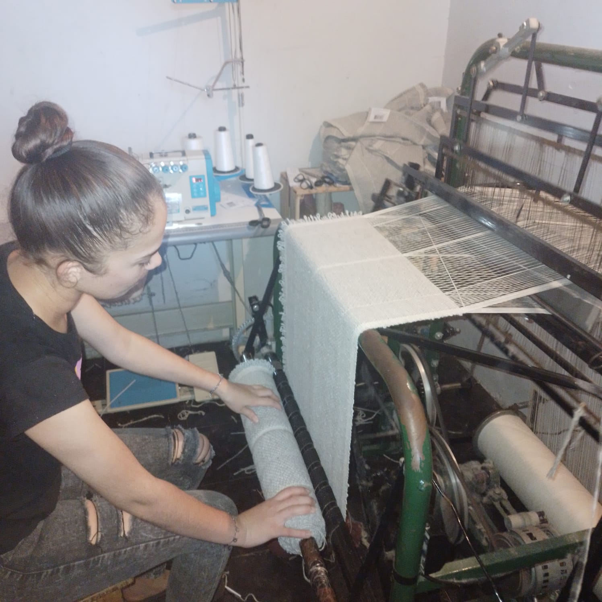
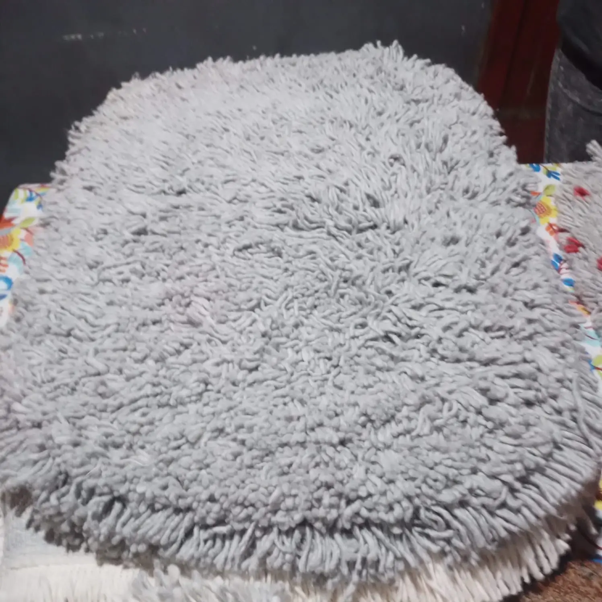

# La Conquista - Alfombras Artesanales

## Descripción

**La Conquista** es una página web dedicada a la venta de alfombras artesanales 100% de algodón. Ofrecemos una variedad de alfombras tipo Handira circulares y rectangulares todas hechas a mano. Nuestro objetivo es proporcionar piezas únicas para la decoración de interiores, hechas con los mejores materiales.

## Tecnologías Utilizadas

- **HTML5** y **CSS3**
- **Bootstrap 5**: Para el diseño responsivo y componentes visuales.
- **Bootstrap Icons**: Íconos utilizados en la página.
- **JavaScript**: Para la validación del formulario de contacto.
- **Formspree**: Manejo de formularios de contacto.
- **Metaetiquetas**: Optimización para SEO y redes sociales.

## Secciones del Sitio

### 1. Productos
En esta sección, puedes explorar nuestra colección de alfombras, organizadas en diferentes tipos y tamaños, como alfombras circulares, semicirculares y rectangulares. Cada producto incluye imágenes y dimensiones para que los clientes puedan elegir el adecuado para su espacio.

### 2. Nosotros
Aquí compartimos la historia de **La Conquista** y cómo nos especializamos en la creación de alfombras artesanales. También cuenta con un carrusel de imágenes que muestra nuestro trabajo y procesos.

### 3. Contacto
Un formulario de contacto que permite a los usuarios enviar consultas o pedidos personalizados. Además, se proporciona información de contacto como la dirección física, el número de teléfono y enlaces a nuestras redes sociales.

## Capturas de Pantalla

### Página de Inicio
width="300";

### Productos
width="300";

